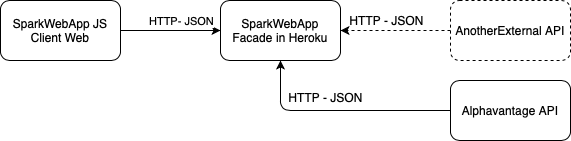
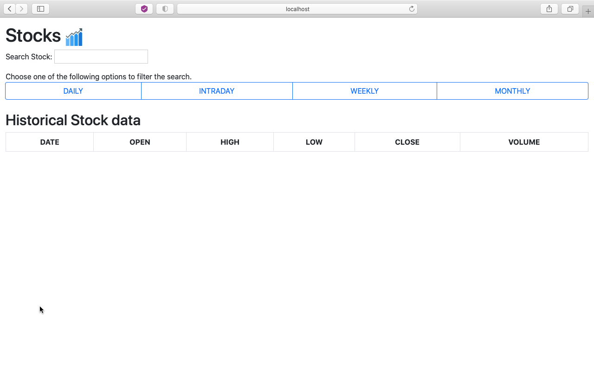
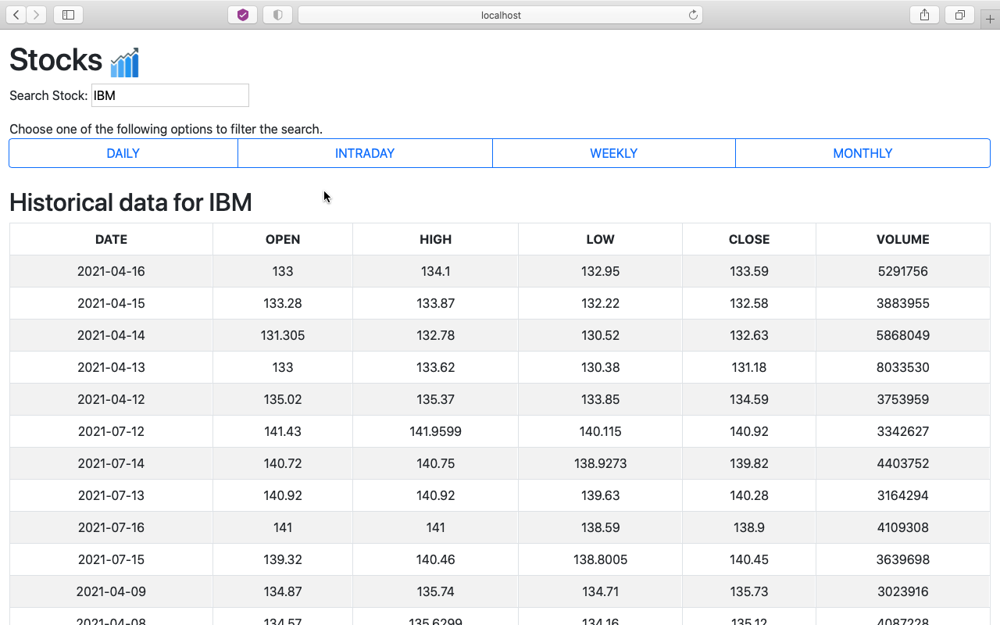
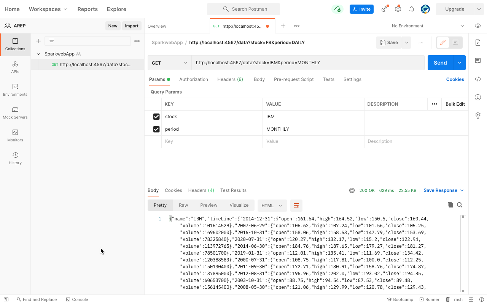

# TAREA INTRODUCCIÓN MVN-GITY HEROKU
El presente proyecto comprende una aplicación que demuestre una simple arquitectura de Microservicios desplegada en Heroku para un cliente en particular, para este caso se construye una aplicación para consultar el mercado de valores de las acciones negociadas en Bolsa.

#### Enlace a Heroku

## _Arquitectura_

## Descripción del Diseño
Los componentes principales que comprenden el diseño de la arquitectura son:
- Un *Cliente Web JS*, asíncrono que invoca servicios REST desplegados en Heroku y usa Json como formato para los mensajes.
- Un *servidor de Heroku*, como gateway para encapsular las peticiones a otros servicios web externos.
- Un *Servidor Fachada*, que expone los servicios REST.
- Un *Cliente Java*, para probar las funciones del servidor facade en Heroku a través de conexiones Http a los servicios. Dicho servicio contiene una estructura de datos **ConcurrentHashMap** que actuará como caché y permitirá **NO** realizar llamados nuevamente al servicio, con parámetros específicos previamente realizados; además de atender a multiples usuarios que accedan al mismo.
- Todos los protocolos de comunicación se dan sobre **HTTP** y el formato de los mensajes de intercambio siempre son **JSON**.

### Atributos de calidad
El proyecto se encuentra modularizado y organizado en **controlador**, **servicio**, **datos** y **caché**. Usa **patrones estructurales** como *Facade* para delegar las peticiones de los clientes a los componentes apropiados dentro de la arquitectura  y *patrones de comportamiento** como *Iteractor* para recorrer una estructura de datos sin que sea necesario conocer la estructura interna de la misma.

Adicionalmente, permite la extensión de la función de obtención de información por nombre de acción (de la bolsa de valores) y el tiempo para filtrar el histórico de la búsquedan de nuevos proveedores de servicios.

## Ejemplo
Para agregar por ejemplo el api externo de [iexCloud](https://iexcloud.io) se debe en orden, en el acceso al api externo en cuestión (que se encuentra en el componente caché, por medio del componente servici, de obtención de la información por nombre de acción y tiempo para filtrar), agregar una nueva conexión a dicho endpoint, siguiente la plantilla del acceso al api externo [alphavatnage](https://www.alphavantage.co/documentation/) presente en el proyecto y conociendo la estructura recibida del JSONObject del api externo nuevo, se crea un objeto con dicha estructura, y posteriormente se extrae para crearlo y asignar los datos recibidos en el nuevo objeto, que nos servirá para por medio del nombre y el tiempo de la acción(stock) a consultar, obtener sus datos y acceder a ellos tanto del Cliente java como del Cliente JS Web.

## Aplicación Web

> Probando el endpoint

## Herramientas utilizadas

| Herramienta | Uso |
| ------ | ------ |
| Maven | Gestión y construcción del proyecto |
| Eclipse IDE | Plataforma de desarrollo |
| JUnit | Automatización de pruebas unitarias |
| Git | Sistema de control de versiones |
| Github | Respositorio del código fuente |
| Heroku | Plataforma de producción |

## Autor
Laura Alejandra Izquierdo Castro